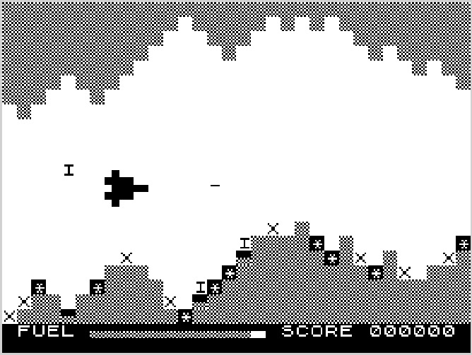
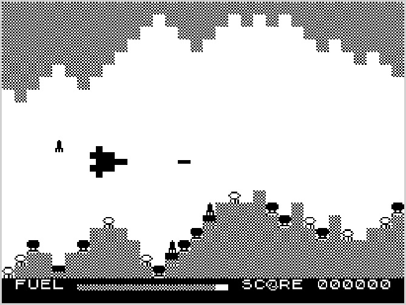
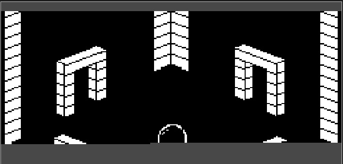
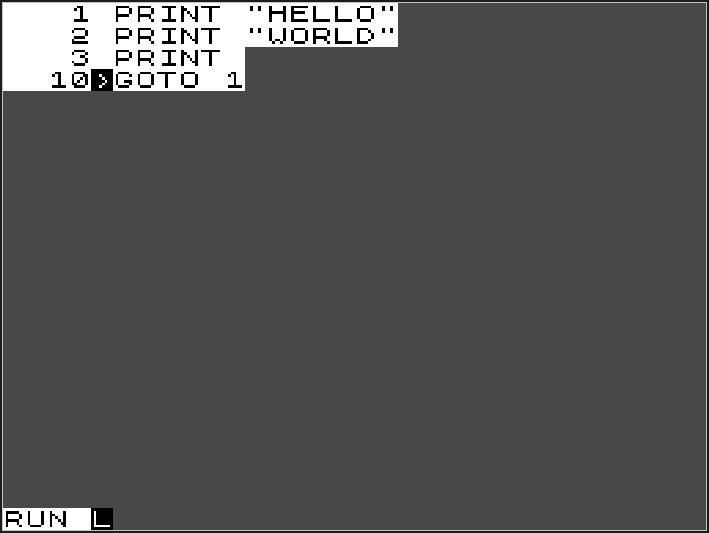

# ZX81
This document describes how the ZX81 "zsim" configuration can be used.

# zsim
The internal simulator "zsim" can be used for the ZX81.
The easiest thing to do so is by using a "preset", e.g.
~~~json
"zsim": {
	"preset": "zx81"
	...
}
~~~

This will configure an 56k ZX81, i.e. a ZX81 with all available RAM, so that it can also show ARX graphics.
What it does is to set the following zsim properties:
~~~json
	"memoryModel": "ZX81-56K",
	"cpuFrequency": 3250000,
	"defaultPortIn": 0xFF,
	"zxKeyboard": "zx81",
	"ulaScreen": "zx81",
	"zx81UlaOptions": {
		"hires": true,
		"firstLine": 56,
		"lastLine": 247,
        "chroma81": {
            "available": true,
            "enabled": false,
            "mode": 0,
            "borderColor": 0
        },
        "debug": false
  	},
    "zx81LoadTrap": true
~~~

If you use the preset you can easily override the defaults, e.g. to define a 16k ZX81 use:
~~~json
	"preset": "zx81",
	"memoryModel": "ZX81-16K",
~~~

# Boot the ROM
If you want to start the ZX81 without any program, i.e. just turn it on, don't use any "load..." properties. Instead set the "execAddress" to 0.
~~~json
"execAddress": "0"
~~~

Note:
- The "execAddress" property is a general property, so it is outside "zsim".
- In fact you could even skip the "execAddress" property, as it's default is 0 anyway.

# Chroma 81 support
 "zx81UlaOptions":
  ~~~
  {
    "hires": true,
    "firstLine": 56,
    "lastLine": 247,
    "chroma81": {
        "available": true,
        "enabled": false,
        "mode": 0,
        "borderColor": 0,
        "colourizationFile": ""
    },
    "debug": false
  }
  ~~~
  The above shows the default values.
    - "hires": If true the generation of the screen output by the cpu is simulated. This allows to display hires programs. If false the ZX81 dfile is converted directly into screen graphics. This can be an advantage when debugging a non-hires game.
    - "firstLine"/"lastLine": Used only if "hires" is true. The first and last line (inclusive) that should be displayed.
    - "debug": If true a gray background is shown for the screen areas without output. Makes a difference for collapsed dfiles, i.e. only for ZX81 with 1-2k memory. If "chroma81" is selected it also initialized the chroma81 RAM (0xC000-0xFFFF) to 2 colors. Otherwise you might not see anything if ink and paper color are equal.
    - "chroma81": Supports the chroma81 (see [Chroma 81 Interface](http://www.fruitcake.plus.com/Sinclair/ZX81/Chroma/ChromaInterface.htm)).
      - "available": Attach the chroma81. Now it can be enabled/disabled via port 0x7FEF.
      - "enabled": The initial state of the chroma81.
      - "mode": The initial color mode (0/1) of the chroma81.
      - "borderColor": The border color: 0-15 (like spectrum colors).
      - "colourizationFile": You can enter here the file path of your colourization file. You can get a lot of colourization files [here](http://www.fruitcake.plus.com/Sinclair/ZX81/Chroma/ChromaInterface_Software_ColourisationDefinitions.htm).

# Load a program
DeZog can load .p, .p81 and .81 files (which are more or less the same anyway) with the "load" property.
Additionally you can also load raw data with the "loadObjs" property.

You can as well load from a file by entering `LOAD "<filename>"` in the ZX81.
This is only enabled if "zx81LoadTrap" is set to true.
In that case the CPU's program counter is checked. When it tries to load from tape the loading from file is injected.

For clarification: if you load with "load" in the launch.json the "zx81LoadTrap" functionality is not used and you don't need to have the flag enabled.
But any successing `LOAD` of the ZX81 would require this flag to be enabled, so it is enabled by default for the "zx81" preset.

If you use "load" any successing `LOAD` of a .p file will be done from the same folder as you used for "load".
If you don't use "load" the `LOAD` will search for the file in the workspace of vscode.

It is also possible to use folders within the `LOAD` command and you give the filename with or without extension, e.g. `LOAD "FOLDER/GAME"` would load the file `GAME.P` from `FOLDER`.
If you do not enter a filename, e.g. `LOAD ""` then the first (.p) file in the folder will be loaded.

You can also use globbing/wildcards. E.g. `LOAD "WR*/**/BOW*"` can result in loading the file from path "wrx/sub/bowling.p".

Note:
- Globbing is done for `LOAD "..."` but not for "load" in launch.json.
- `LOAD` also supports the load-address syntax. E.g. `LOAD "MUNCHER.UDG;8192"` will load the raw data file MUNCHER.UDG to address 8192.

## Loading a .p file
Outside the "zsim" property use e.g:
~~~json
"load": "Galactica.p"
~~~

This will correctly load the .p file to memory and set the system variables 0x4000-0x4008.
Afterwards the program counter (PC) is set to start at 0x0207 (just after the ROM's load/save routine).
The program either starts automatically or you will get the ZX Basic prompt.

## Modding
Although this is not directly related to debugging you can use DeZog very easily to mod the graphics of ZX81 games.
Here as an example "Battlestar Galactica":

The game with normal graphics, using the standard ZX81 charset:

And here with a modded, custom charset:

Of course, the changes you can do with this are limited as characters are re-used for other purposes (e.g. the "O" in "SCORE" which is also a meteor in the game).
But on the other hand it is a very easy change.

The only thing you need to do is to overwrite the ROM charset with your custom one.
You do it with a "loadObjs" like this:
~~~json
"loadObjs": [
	{	// Overwrite the charset
		"path": "galactica_chars.bin",
		"start": "0x1E00"
	}
]
~~~

As the ROM can be easily overwritten by DeZog it replaces all original bytes (characters) with that from galactica_chars.bin.

To create galactica_chars.bin you can use a e.g. a hex editor, it's size should not exceed 512 bytes.

More comfortable you could also use an assembler like sjasmplus to generate the bin file.

### Generate a custom charset with sjasmplus
[galactica_chars.asm](extra/galactica_chars.asm) holds the assembled code for a modified charset.
Use
~~~
sjasmplus --raw=galactica_chars.bin galactica_chars.asm
~~~
to convert it into a a binary galactica_chars.bin.

You can use it (as shown above) in "loadObjs".

The assembler code for the original charset can be found here: [zx81-standard-chars.asm](extra/zx81-standard-chars.asm).

Here is the example for the modified "I" which is turned into a rocket:
~~~asm
; 0x2E: 'I', modified: Rocket
        DEFB    00001000b
        DEFB    00011100b
        DEFB    00011100b
        DEFB    00011100b
        DEFB    00011100b
        DEFB    00111110b
        DEFB    00101010b
        DEFB    00101010b
~~~
Original:
~~~asm
; 0x2E: 'I'
        DEFB    00000000b
        DEFB    00111110b
        DEFB    00001000b
        DEFB    00001000b
        DEFB    00001000b
        DEFB    00001000b
        DEFB    00111110b
        DEFB    00000000b
~~~

## The Colourization Files

TODO

# ULA (The screen display)
The ULA was the HW chip that, together with the CPU, was responsible for the video generation.
It worked closely together with the Z80 CPU to generate the video signal.
For details here are some references:
- https://k1.spdns.de/Vintage/Sinclair/80/Sinclair%20ZX80/Tech%20specs/Wilf%20Rigter%27s%20ZX81%20Video%20Display%20Info.htm
- https://8bit-museum.de/heimcomputer-2/sinclair/sinclair-scans/scans-zx81-video-display-system/
- https://oldcomputer.info/8bit/zx81/ULA/ula.htm

The simulator is capable of 2 different systems to display video.
Both simulate the timing as much as possible enabling the simulator to display hires graphics.
You can choose between modes by setting "hires" to true or false (default is true).
~~~json
"zx81UlaOptions": {
	"hires": true/false
}
~~~
You can simulate pseudo-hires, hires (wrx, arx) and non-hires games/programs with "hires" set to "true".
Setting "hires" to false can be an advantage when debugging/developing non-hires games.
If "hires" is false the dfile (the video screen) is decoded by "zsim" directly.
The advantage is that any change in the screen is immediately visible as soon as the byte is added to the dfile.
I.e. you can see the changes while your code is writing to the dfile and you are stepping through it.
If "hires" is true, any changes would become visible only when the Z80 software takes care of the video generation.

To visualize this a little bit, here is a screenshot of the hires game ["Against The Elements"](http://www.fruitcake.plus.com/Sinclair/ZX81/NewSoftware/AgainstTheElements.htm]):

The current write position is where the bottom black line ends.
When single stepping this changes as more bytes are written one by one:

If "hires" is set to false you will always see a complete screen independent of the exact vertical and horizontal timing.

So it depends:
If you are developing a standard graphics game then `"hires": false` is the recommended choice.
If you are developing a hires game you have to use `"hires": true`, of course.

Note: To simulate ARX hires graphics you need to use a memory model that enables RAM in the area 0x2000-0x3FFF, i.e. "ZX81-56K".

## Collapsed dfile
In a ZX81 with 1-2k RAM the dfile is collapsed, i.e. it uses only the full width of a line if necessary. If the line does not contain anything no RAM is used for it.
In zsim this can be visualized (in standard and hires mode) with the "debug" option.
If "debug" is true, everything that is not output to the screen is gray.

Here is the display of a ZX81 with only 1k RAM:

## firstLine, lastLine
These 2 properties are only used if "hires" is true.
With the values you can adjust the shown screen height.
Normally the default values (46, 247) should work fine.
However, depending on the hires algorithm the Z80 program uses it might be that a different area has been chosen.
- firstLine is the first horizontal line that will be displayed
- lastLine is the last horizontal line that will be displayed (inclusive)

# CPU frequency
The original ZX81 runs at 3.25 Mhz.
This is also the default in zsim if `"preset": "zx81"` is chosen.
However, if you have a fast computer then you can adjust the frequency and get a faster simulation.
E.g.
~~~json
	"cpuFrequency": 30000000,
~~~
will set the frequency to 30 Mhz.
Of course, if the simulator is able to reach the speed depends on the capabilities of your computer.
With a mac mini M2 you can expect to achieve around 7 Mhz at least.
I.e. you can double the speed of the ZX81.
Sometimes this can be handy, if computation in the ZX81 takes a long time.
All the ULA timing depends on the t-states only, i.e. it works independent of the cpu frequency.
Thus also the video output simply happens faster.

Another way to let the simulator run faster is to use the general "limitSpeed" property.
This is true by default and limits the execution speed to the Z80 cpu frequency.

If "limitSpeed" is set to false, the simulation will always run at maximum speed.

Note: If the simulation speed is not able to cope anymore with the cpu frequency the CPU Load indication will turn to yellow.

# The Keyboard
Set
~~~json
	"zxKeyboard": "zx81"
~~~
to show the keyboard:

The keys on the keyboard can be turned on/off by clicking with the mouse.
You can also just use you real keyboard to simulate keypresses (note: the simulator view nees to have focus to receive keypresses, i.e. click once inside the simulator view so that it has focus).

The Shift key is mapped to the left Alt key.
But many real key combinations do work as well, e.g. a Shift-2 will generate the ZX81 key sequence Shift-P to create the quote character ".

# Joysticks
To simulate any joystick you can use the "customJoystick".
It will map the keys of a joystick attached to your computer to ports/bits in the ZX81.
Please refer to the description in [Usage.md](../Usage.md).
For "Battlestar Galactica" you could use:
~~~json
    "customJoy": {
        // ZX81: Battlestar Galactica
        "down": { // 6
            "portMask": "0x0801",
            "port": "0x00",
            "bit": "0x10"
        },
        "up": { // 7
            "portMask": "0x0801",
            "port": "0x00",
            "bit": "0x08"
        },
        "fire": { // 0
            "portMask": "0x0801",
            "port": "0x00",
            "bit": "0x01"
        },
        "fire2": { // 9
            "portMask": "0x0801",
            "port": "0x00",
            "bit": "0x02"
        }
	}
~~~
Please note that "Battlestar Galactica" only uses a partial address decoding.

# Attribution
Many thanks to the authors of the mentioned games:
- "Battlestar Galactica", Ch. Zwerschke
- ["Against The Elements"](http://www.fruitcake.plus.com/Sinclair/ZX81/NewSoftware/AgainstTheElements.htm]), Paul Farrow
